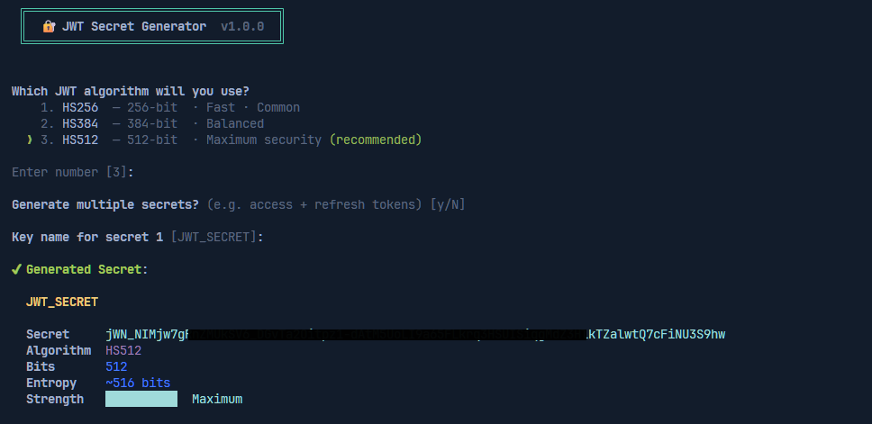

# jwt-secret-gen



Generate cryptographically secure JWT secrets(interactively or fully automated via flags).

Works anywhere: `bunx`, `npx`, `pnpm dlx`, `yarn dlx`, or installed globally.

---

## Quick Start

```bash
# Interactive (recommended)
bunx jwt-secret-gen

# Or with npm/pnpm
npx jwt-secret-gen
pnpm dlx jwt-secret-gen
```

---

## Install Globally

```bash
bun add -g jwt-secret-gen
npm install -g jwt-secret-gen

# Then use anywhere
jwt-secret-gen
```

---

## Usage

```
jwt-secret-gen [flags]
```

### Flags

| Flag              | Description                                         | Default      |
| ----------------- | --------------------------------------------------- | ------------ |
| `-h, --help`      | Show help                                           | —            |
| `-v, --version`   | Show version                                        | —            |
| `-y, --yes`       | Skip all prompts, use defaults                      | `false`      |
| `--print`         | Print secret to stdout only (pipe-friendly)         | `false`      |
| `--env`           | Write to .env file without prompting                | `false`      |
| `-m, --multiple`  | Generate multiple secrets at once                   | `false`      |
| `-a, --algorithm` | `HS256` \| `HS384` \| `HS512`                       | `HS512`      |
| `-b, --bits`      | Custom bit length: `128` \| `256` \| `384` \| `512` | From algo    |
| `-k, --key`       | .env key name                                       | `JWT_SECRET` |
| `-c, --count`     | Number of secrets when using `--multiple`           | `2`          |
| `--env-file`      | Path to .env file                                   | `.env`       |
| `--no-color`      | Disable ANSI color output                           | `false`      |

---

## Examples

### Interactive mode

```bash
bunx jwt-secret-gen
```

Walks you through algorithm, key names, and where to put the secret.

### Write directly to `.env`

```bash
bunx jwt-secret-gen --env -y
# Appends JWT_SECRET="..." to .env
```

### Generate access + refresh secrets

```bash
bunx jwt-secret-gen --env --multiple
# Prompts for key names, defaults to JWT_SECRET + JWT_REFRESH_SECRET
```

### Custom key name

```bash
bunx jwt-secret-gen --env --key MY_JWT_SECRET -y
```

### Pipe into a script

```bash
SECRET=$(bunx jwt-secret-gen --print -y)
echo "Got: $SECRET"
```

### Use a specific algorithm

```bash
bunx jwt-secret-gen --algorithm HS256 --env -y
```

### Point at a different env file

```bash
bunx jwt-secret-gen --env --env-file .env.production -y
```

---

## Algorithm Guide

| Algorithm | Bits | Use case                          |
| --------- | ---- | --------------------------------- |
| HS256     | 256  | Fine for most apps                |
| HS384     | 384  | Balanced security                 |
| HS512     | 512  | **Recommended** — maximum entropy |

All secrets are generated using `crypto.getRandomValues()` — cryptographically secure, not `Math.random()`.

---

## Safety Features

- ✅ Uses `crypto.getRandomValues()` (CSPRNG)
- ✅ Detects existing keys and warns before overwriting
- ✅ Offers to add `.env` to `.gitignore` if missing
- ✅ Secrets encoded as `base64url` (URL-safe, no special chars)
- ✅ Entropy display so you know exactly what you're getting

---

## License

MIT
